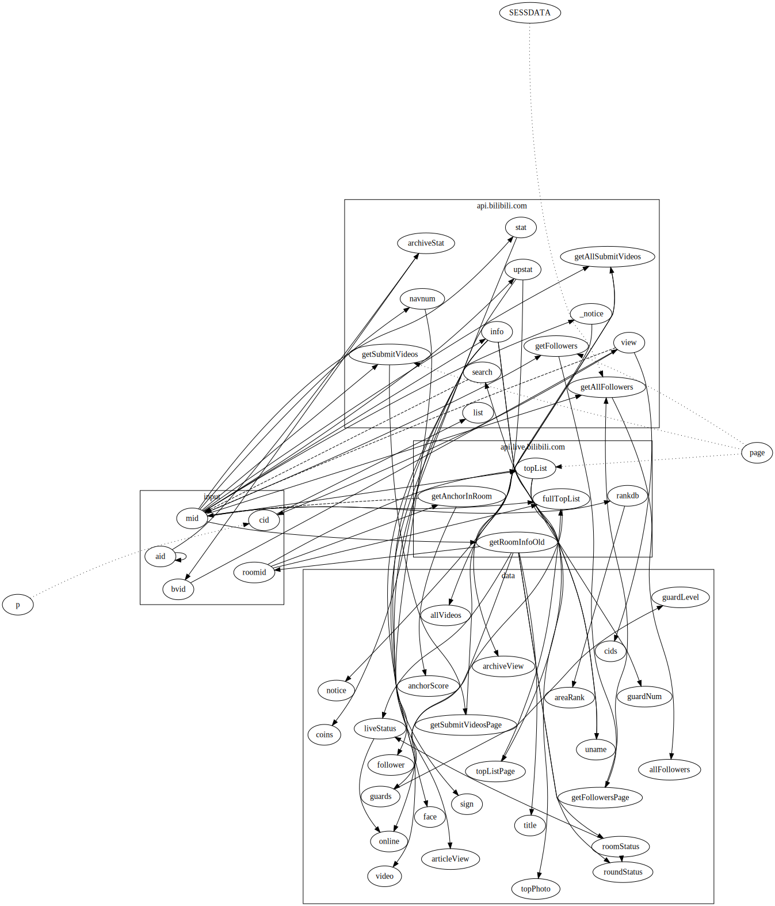

# Bili-api  [](https://coveralls.io/github/simon300000/bili-api) [](https://www.npmjs.com/package/bili-api)

```javascript
let object = await biliAPI({ mid: 349991143 }, ['uname', 'guardNum'])
object.uname // → "神楽Mea_Official"
object.guardNum // → 316
```

# 目录

- [biliAPI](#biliapi)
  * [安装](#%E5%AE%89%E8%A3%85)
  * [用法](#%E7%94%A8%E6%B3%95)
    + [biliAPI Document](#biliapi-document)
    + [Router Graph](#router-graph)
- [Bilibili API Document](#bilibili-api-document)
  * [DATAs](#datas)
    + [stat](#stat)
    + [info](#info)
    + [view](#view)
    + [list](#list)
    + [\_notice](#_notice)
    + [video](#video)
    + [guardNum](#guardnum)
    + [guards](#guards)
    + [guardLevel](#guardlevel)
    + [roundStatus](#roundstatus)
    + [liveStatus](#livestatus)
    + [title](#title)
    + [online](#online)
    + [notice](#notice)
    + [archiveView](#archiveview)
    + [articleView](#articleview)
    + [face](#face)
    + [topPhoto](#topphoto)
    + [liveStartTime](#livestarttime)
    + [mid](#mid)
    + [aid](#aid)
    + [bvid](#bvid)
    + [roomid](#roomid)
    + [rankdb](#rankdb)
    + [dynamics](#dynamics)
    + [dynamicOffset](#dynamicoffset)
- [Contribution](#contribution)

# biliAPI

## 安装

npm

```sh
npm install bili-api -S
```

Yarn

```sh
yarn add bili-api
```

## 用法

```javascript
const biliAPI = require('bili-api')
;
(async () => {
  let up = await biliAPI({ mid: 349991143 }, ['follower'])
  up.follower // → 849110
})()
```

以上便是根据<[mid](#api_mid)>查找粉丝数，很简单对不对→\_→

想看看推的VTB有几个舰长，几个提督，有没有石油佬上总督？没问题！

```javascript
const biliAPI = require('bili-api');

(async () => {
  let { guardLevel } = await biliAPI({ mid: 415578378 }, ['guardLevel'], { wait: 200 })
  guardLevel // → [
  //  0,
  //  2,
  //  11
  //]
})()
```

部分API支持不同来源分支查询，比如通过用户名查找 mid，后查找其余信息。

```javascript
const biliAPI = require('bili-api');

(async () => {
  let { guardNum } = await biliAPI({ uname: '帕里_Paryi' }, ['guardNum'])
  guardNum // → 50
})()
```

通过视频 av 号查找UP主 mid，后查找UP主其余信息。

```javascript
const biliAPI = require('bili-api');

(async () => {
  // 迷 迭 迷 迭 帕 里 桑
  let { uname } = await biliAPI({ aid: 54299141 }, ['uname'])
  uname // → "德國马牌酸菜客服汉斯"
})()
```

### biliAPI Document

```javascript
/**
 * @method biliAPI
 * @param  {Object}    object        输入的信息
 * @param  {Array}     targets       需要的目标信息
 * @param  {Function}  [option]      设置
 * @return {Promise}                 Resolve一个带有所需targets的Object
 */
biliAPI(object, targets[, option])
```

- `object`: Object，提供目前知道的信息，比如 `{ mid: 349991143 }`，不同key的说明可以参阅[IDs](#ids)

- `targets`: Array，需要的信息，比如 `['follower']`，每个值的说明可以参阅[APIs](#apis)

- `option`: Object，可选设置。

  - `wait`: Number，默认0。

    如果在短时间发起过多请求，可能会被bilibili暂时banIP，所以可以在这里指定一个请求delay，单位 ms 毫秒，每一个网络请求都会暂停一段时间。

    比如上面的获取舰团数据例子就有 200 毫秒延迟，因为它需要遍历舰团的每一页，所以最好设置一个delay。

<!-- #### Option -->

#### 更多例子:

##### 获取所有视频

```javascript
const biliAPI = require('bili-api');

(async () => {
  let { allVideos } = await biliAPI({ mid: 380829248 }, ['allVideos'])
  allVideos.length  // → 394
  allVideos[0]  // → {
  //  "comment": 66,
  //  "typeid": 17,
  //  "play": 11477,
  //  "pic": "//i0.hdslb.com/bfs/archive/59963a9223f6b23b459328ad25683b200f30f8c8.jpg",
  //  "subtitle": "",
  //  "description": "2020年9月26日油管直播节选\n──────────────────────────────────────────\n剪辑：真名看破\n翻译：东方\n时轴：银河猫喵喵\n校对：千里光\n──────────────────────────────────────────\n【日月咪玉】\n推特：https://twitter.com/HizukiMiu\n油管：https://www.youtube.com/channel/UCM6iy_rSgSMbFjx10Z6VVGA\n【樱月花音】\n推特：https://twit",
  //  "copyright": "",
  //  "title": "【花园Serena×樱月花音×日月咪玉】惊恐PACIFY",
  //  "review": 0,
  //  "author": "花园Serena",
  //  "mid": 380829248,
  //  "created": 1612267806,
  //  "length": "10:01",
  //  "video_review": 26,
  //  "aid": 798880110,
  //  "bvid": "BV1vy4y117S8",
  //  "hide_click": false,
  //  "is_pay": 0,
  //  "is_union_video": 0,
  //  "is_steins_gate": 0
  //}
})()
```

##### 获取视频分P的所有cid

```javascript
const biliAPI = require('bili-api');

(async () => {
  let { cids } = await biliAPI({ aid: 27702699 }, ['cids'])
  cids // → [
  //  154130876,
  //  153368014,
  //  153022084,
  //  152986511,
  //  152985543,
  //  152425880,
  //  152002045,
  //  150297919,
  //  149694024,
  //  148577829,
  //  148579293,
  //  148575538,
  //  147100251,
  //  146848245,
  //  146854231,
  //  146834824,
  //  144775534,
  //  144342789,
  //  144606741,
  //  144044432,
  //  144039296,
  //  144044987,
  //  141818927,
  //  141375841,
  //  140200064,
  //  140201152,
  //  140201635,
  //  138312230,
  //  138314190,
  //  138313436,
  //  138095411,
  //  138313721,
  //  137399592,
  //  138300762,
  //  137513774,
  //  137354408,
  //  136834104,
  //  136415428,
  //  136413554,
  //  136205486,
  //  135178666,
  //  135081523,
  //  135082155,
  //  134965028,
  //  134890616,
  //  134686293,
  //  134482642,
  //  134383394,
  //  134383290,
  //  134072123,
  //  134686834,
  //  133674390,
  //  132804903,
  //  132250522,
  //  132252236,
  //  132251210,
  //  131783391,
  //  138302683,
  //  131095190,
  //  130775348,
  //  130679944,
  //  130544896,
  //  130064858,
  //  130064687,
  //  130065169,
  //  129494135,
  //  129471844,
  //  128741177,
  //  128328466,
  //  127911562,
  //  127882591,
  //  126961245,
  //  127411295,
  //  126577294,
  //  126412246,
  //  126412697,
  //  125886700,
  //  125353459,
  //  124221119,
  //  124220678,
  //  124220626,
  //  123977663,
  //  123669381,
  //  124940385,
  //  123102926,
  //  123062231,
  //  122770200,
  //  122705097,
  //  122541408,
  //  121700107,
  //  121698981,
  //  121698543,
  //  122249080,
  //  121698118,
  //  120802623,
  //  120568983,
  //  120419369,
  //  119155112,
  //  118858442,
  //  118514627,
  //  117565934,
  //  117348519,
  //  117346761,
  //  117345948,
  //  117343514,
  //  117349741,
  //  117349698,
  //  116186644,
  //  114763979,
  //  114638549,
  //  114418415,
  //  114230987,
  //  113685416,
  //  113606632,
  //  112946049,
  //  112305652,
  //  112299881,
  //  112249982,
  //  112249847,
  //  112249715,
  //  111800712,
  //  111823761,
  //  111806238,
  //  111805606,
  //  111804322,
  //  110947294,
  //  110946620,
  //  113607080,
  //  110945683,
  //  108734088,
  //  108728098,
  //  108721702,
  //  108721496,
  //  107242490,
  //  107147481,
  //  113607702,
  //  106752299,
  //  106738746,
  //  106011326,
  //  105885163,
  //  105883722,
  //  105131095,
  //  103894110,
  //  103893362,
  //  103025841,
  //  103029620,
  //  100426228,
  //  100438286,
  //  100073514,
  //  100067702,
  //  100064630,
  //  98140930,
  //  98176581,
  //  97497904,
  //  97074496,
  //  98171575,
  //  96396213,
  //  96396029,
  //  94227448,
  //  94789318,
  //  94254317,
  //  93784890,
  //  94257750,
  //  94317035,
  //  94319102,
  //  94319353,
  //  94319982,
  //  94320142,
  //  94320271,
  //  94320723,
  //  94320982,
  //  94320998,
  //  94321024,
  //  97056382,
  //  96535734,
  //  96534727,
  //  96534219,
  //  96533304,
  //  96541034,
  //  103127764,
  //  103128533,
  //  103129216,
  //  103129712,
  //  103129922,
  //  103130328,
  //  103130885,
  //  103130897,
  //  103131464,
  //  103132696,
  //  103132455,
  //  103132879,
  //  103111181,
  //  103112536,
  //  103113244,
  //  103114950,
  //  103117360,
  //  103118025,
  //  103118461,
  //  103119415,
  //  47780428
  //]
})()
```

### Router Graph



# Bilibili API Document

这里收集的API应该属于"匿名API(自造词)"，即不需要 登陆/appkey 的API。

用处大概是公开信息获取，暂时没有涉及类似"发弹幕/评论"相关API的打算。

以下是可能满足类似需求的资料：

[fython/BilibiliAPIDocs: Bilibili API (For thrid-party) Documents 哔哩哔哩开放接口第三方文档](https://github.com/fython/BilibiliAPIDocs)

[lovelyyoshino/Bilibili-Live-API: BILIBILI 直播/番剧 API](https://github.com/lovelyyoshino/Bilibili-Live-API)

[Vespa314/bilibili-api: B站API收集整理及开发，测试【开发中】](https://github.com/Vespa314/bilibili-api)

## DATAs

* ### <a name="api_stat"></a>stat

  UP主统计数据
  
  *前置:* <[mid](#api_mid)>

* ### <a name="api_info"></a>info

  UP主信息
  
  *前置:* <[mid](#api_mid)>

* ### <a name="api_view"></a>view

  视频信息
  
  *前置:* <[bvid](#api_bvid)>

* ### <a name="api_list"></a>list

  弹幕
  
  *前置:* <[cid](#api_cid)>

* ### <a name="api__notice"></a>\_notice

  UP主公告
  
  *前置:* <[mid](#api_mid)>

* ### <a name="api_video"></a>video

  UP主的视频数
  
  *前置:* <[spaceSearch](#api_spaceSearch)>

* ### <a name="api_guardNum"></a>guardNum

  直播舰团
  
  *前置:* <[topList](#api_topList)>

* ### <a name="api_guards"></a>guards

  舰团列表
  
  *前置:* <[fullTopList](#api_fullTopList)>

* ### <a name="api_guardLevel"></a>guardLevel

  舰团各等级数
  
  *前置:* <[guards](#api_guards)>

* ### <a name="api_roundStatus"></a>roundStatus

  轮播状态，轮播中为`1`
  
  *前置:* <[roomStatus](#api_roomStatus)>, <[getRoomInfoOld](#api_getRoomInfoOld)>

* ### <a name="api_liveStatus"></a>liveStatus

  直播状态，直播中为`1`，轮播/没播为`0`
  
  *前置:* <[roomStatus](#api_roomStatus)>, <[getRoomInfoOld](#api_getRoomInfoOld)>

* ### <a name="api_title"></a>title

  直播间标题
  
  *前置:* <[getRoomInfoOld](#api_getRoomInfoOld)>

* ### <a name="api_online"></a>online

  直播间当前人气值
  非直播状态为0
  
  *前置:* <[liveStatus](#api_liveStatus)>, <[getRoomInfoOld](#api_getRoomInfoOld)>

* ### <a name="api_notice"></a>notice

  公告
  
  *前置:* <[_notice](#api__notice)>

* ### <a name="api_archiveView"></a>archiveView

  UP主播放数
  
  *前置:* <[upstat](#api_upstat)>

* ### <a name="api_articleView"></a>articleView

  UP主阅读数
  
  *前置:* <[upstat](#api_upstat)>

* ### <a name="api_face"></a>face

  UP主头像的链接
  
  *前置:* <[info](#api_info)>

* ### <a name="api_topPhoto"></a>topPhoto

  个人空间头图
  
  *前置:* <[info](#api_info)>

* ### <a name="api_liveStartTime"></a>liveStartTime

  直播开始时间
  
  *前置:* <[getInfoByRoom](#api_getInfoByRoom)>

* ### <a name="api_mid"></a>mid

  大概是 Member ID?
  UP主个人空间地址 <https://space.bilibili.com/43222001/> 中的`43222001`就是这个`mid`了
  
  

* ### <a name="api_aid"></a>aid

  就是av号啦→\_→
  比如视频 <https://www.bilibili.com/video/av2134250/> 中的`2134250`就是`aid`
  
  *前置:* <[aid](#api_aid)>

* ### <a name="api_bvid"></a>bvid

  就是bv号，新出的www
  比如视频 <https://www.bilibili.com/video/BV1Xs411S77y> 中的`BV1Xs411S77y`就是`bvid`
  
  *前置:* <[archiveStat](#api_archiveStat)>

* ### <a name="api_roomid"></a>roomid

  直播房间号
  
  *前置:* <[getRoomInfoOld](#api_getRoomInfoOld)>

* ### <a name="api_rankdb"></a>rankdb

  bilibili直播一周元气榜分区排名
  
  *前置:* <[mid](#api_mid)>

* ### <a name="api_dynamics"></a>dynamics

  UP主的动态
  
  *前置:* <[dynamicsRaw](#api_dynamicsRaw)>

* ### <a name="api_dynamicOffset"></a>dynamicOffset

  获取动态的起点。留空或设置为`0`可获取最新动态。使用上一次请求中的`next_offset`可获取下一页动态。
  
  

# Contribution

欢迎各种Issue和Pull Request

开Issue聊天也行→\_→！！！

详细可以阅读 [CONTRIBUTING.md](CONTRIBUTING.md)
