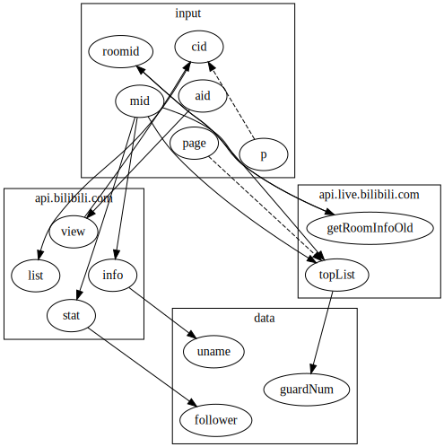

# Bili-api [](https://travis-ci.com/simon300000/bili-api) [](https://coveralls.io/github/simon300000/bili-api) [](https://www.npmjs.com/package/bili-api)

EXAMPLE:1

# 目录

<!--toc-->

# biliAPI

## 安装

npm

```sh
npm install bili-api -S
```

Yarn

```sh
yarn add bili-api
```

## 用法

EXAMPLE:2

以上便是根据<[mid](#api_mid)>查找粉丝数，很简单对不对→\_→

### biliAPI Document

```javascript
/**
 * @method biliAPI
 * @param  {Object}    object        输入的信息
 * @param  {Array}     targets       需要的目标信息
 * @param  {Function}  [option]      设置
 * @return {Promise}                 Resolve一个带有所需targets的Object
 */
biliAPI(object, targets, [option])
```

- `object`: Object，提供目前知道的信息，比如 `{ mid: 349991143 }`，不同key的说明可以参阅[IDs](#ids)

- `targets`: Array，需要的信息，比如 `['follower']`，每个值的说明可以参阅[APIs](#apis)

- `option`: Object，可选设置。

  - `wait`: Number，默认0。

    如果在短时间发起过多请求，可能会被bilibili暂时banIP，所以可以在这里指定一个请求delay，单位 ms 毫秒，每一个网络请求都会暂停一段时间。

<!-- #### Option -->

### Router Graph



# Bilibili API Document

这里收集的API应该属于"匿名API(自造词)"，即不需要 登陆/appkey 的API。

用处大概是公开信息获取，暂时没有涉及类似"发弹幕/评论"相关API的打算。

以下是可能满足类似需求的资料：

[fython/BilibiliAPIDocs: Bilibili API (For thrid-party) Documents 哔哩哔哩开放接口第三方文档](https://github.com/fython/BilibiliAPIDocs)

[lovelyyoshino/Bilibili-Live-API: BILIBILI 直播/番剧 API](https://github.com/lovelyyoshino/Bilibili-Live-API)

[Vespa314/bilibili-api: B站API收集整理及开发，测试【开发中】](https://github.com/Vespa314/bilibili-api)

## DATAs

<!-- [[idDocument]] -->

## APIs

<!-- [[apiDocument]] -->

# Contribution

欢迎各种Issue和Pull Request

开Issue聊天也行→\_→！！！

详细可以阅读 [CONTRIBUTING.md](CONTRIBUTING.md)
